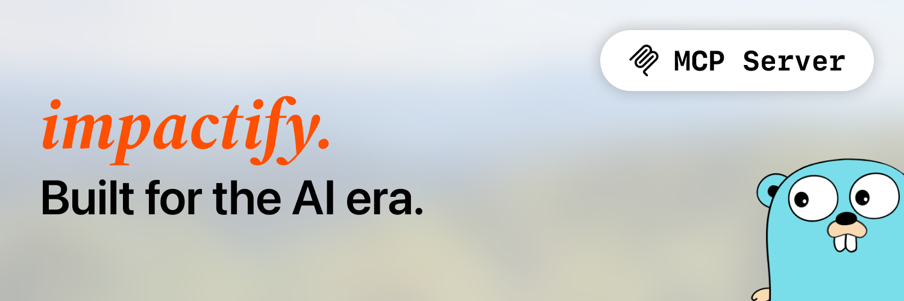
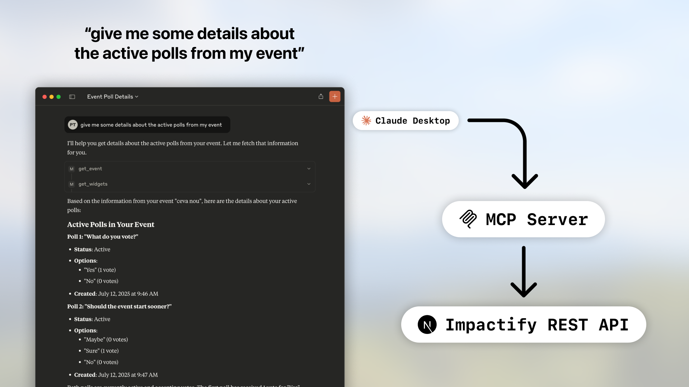

# Impactify MCP Server

[](https://golang.org/)
[](https://modelcontextprotocol.io/introduction)
[](LICENSE)

**mcp-impactify** is a flexible [MCP (Model Context Protocol)](https://modelcontextprotocol.io/introduction) server written in Go. It works as a robust wrapper around the [**Impactify Public REST API**](https://docs.impactify.ro/api) for third-party applications.

## Features

- **Event Management**: Fetch and update event details (title, location, etc.)
- **Widget Operations**: Create, read, update, and delete widgets
- **Flexible Configuration**: Support for custom API endpoints
- **Secure Authentication**: API key-based authentication
- **MCP Compatible**: Works with Claude Desktop and other MCP clients

## Installation

Install the MCP server using Go:

```bash
go install github.com/katistix/mcp-impactify@latest
```

## Configuration

### Basic Setup

Add the following configuration to your MCP client (e.g., Claude Desktop's config):

```json
{
  "mcpServers": {
    "mcp-impactify": {
      "command": "mcp-impactify",
      "args": [],
      "env": {
        "IMPACTIFY_EVENT_API_KEY": "<your_event_api_key>"
      }
    }
  }
}
```

### Custom API Endpoint

To use a custom Impactify API endpoint (e.g., for local development):

```json
{
  "mcpServers": {
    "mcp-impactify": {
      "command": "mcp-impactify",
      "args": [
        "http://localhost:3000/api/rest/v1"
      ],
      "env": {
        "IMPACTIFY_EVENT_API_KEY": "<your_event_api_key>"
      }
    }
  }
}
```

**Note**: By default, the server connects to `https://impactify.ro/api/rest/v1`. Providing a custom URL as the first argument will override this default.

## Getting Your API Key

1. Visit your event on [Impactify](https://impactify.ro)
2. Navigate to your event's settings
3. Generate or copy your Event API Key
4. Use this key in the `IMPACTIFY_EVENT_API_KEY` environment variable

## Available Operations

### Event Operations
- **Fetch Event Details**: Get comprehensive information about your event
- **Update Event**: Modify event properties like title and location

### Widget Operations
- **List Widgets**: Retrieve all widgets in your event
- **Get Widget**: Fetch details of a specific widget
- **Create Widget**: Add new widgets to your event
- **Update Widget**: Modify widget data and properties
- **Delete Widget**: Remove widgets from your event

## Usage with Claude Desktop

1. Install the MCP server as described above
2. Add the configuration to your Claude Desktop config file
3. Restart Claude Desktop
4. The Impactify tools will be available in your conversations




## Requirements

- Go 1.21 or higher
- Valid Impactify Event API Key
- MCP-compatible client (Claude Desktop, etc.)

## License

This project is licensed under the MIT License - see the [LICENSE](LICENSE) file for details.

## Support

For issues and questions:
- Check the [Impactify API Documentation](https://docs.impactify.ro/api)
- Visit [Impactify](https://impactify.ro) for platform support
- Open an issue in this repository for MCP server specific problems
